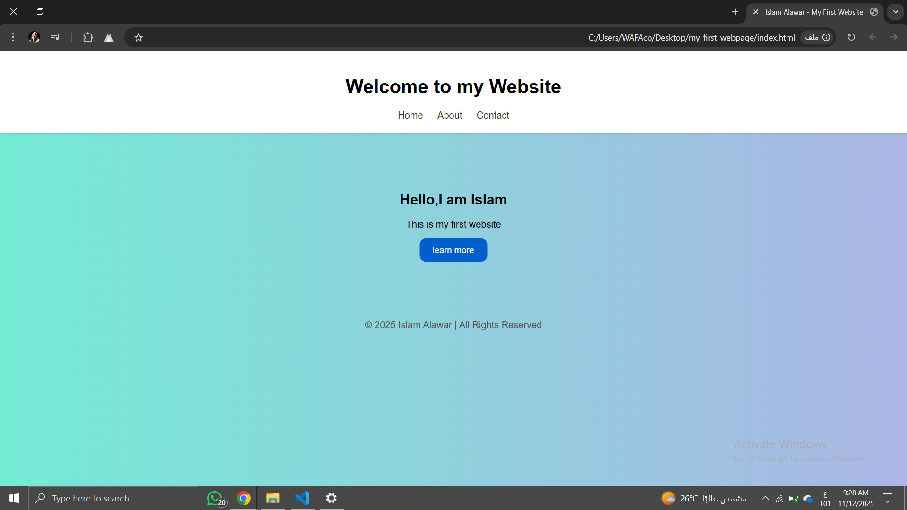

# 🌐 My First Website

This is my **first simple website** built using **HTML and CSS** only.  
It’s a small personal project to practice structure, layout, and styling basics.

---

## ✨ Features
- Clean and modern layout
- Simple navigation bar
- Gradient background
- Animated button hover effect

---

## 🛠️ Technologies Used
- HTML5
- CSS3 (Flexbox & Gradients)

---

## 📸 Preview
Here’s how it looks:

---

## 🚀 Live Demo
You can view the project live here:  
👉 [My First Website](https://islamalaw3r.github.io/my-first-website/)

---

## 💬 About Me
👩🏻‍💻 **Islam Alawar** — Computer Science student from Gaza,  
learning **Front-end Development** and **Cross-platform Mobile Apps**,  
with a growing interest in **Artificial Intelligence**.

